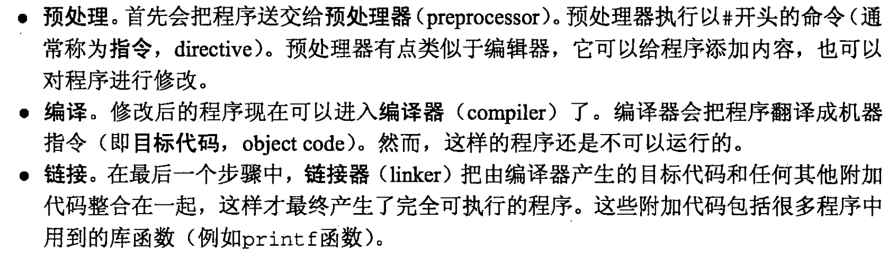

# 基本概念

C 语言中的基本概念：

- 预处理器指令（preprocessor directive）
- 函数
- 变量
- 语句（statement）

### 2.1.2 编译与链接

将C程序转换为机器可执行的形式，通常包含三个步骤

### 2.2.1 指令

在编译C程序之前，预处理器首先会对C进行编辑，我们把预处理器执行的命令称为指令。所有指令都是以字符 #  开始，且指令结尾没有分号。

### 2.6 定义常量（宏定义）

常量可以采用称为宏定义（macro definition）的特性命名。

#define 属于预处理指令，在程序编译时，预处理器会把每个宏用其表示的值替换回来。 

当宏包含运算符时，必须用括号把表达式括起来。

